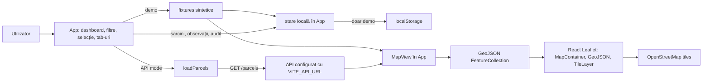

# Arhitectură bazată pe dovezi

Acest document descrie comportamentul verificabil al clientului web actual. Interfața este Romanian-first: etichetele și fluxurile vizibile utilizatorului sunt în română. În acest commit, starea, conversia GeoJSON și componenta hărții sunt implementate în [`src/App.tsx`](../src/App.tsx), nu în module separate `src/store.ts`, `src/domain/geo.ts` sau `src/map/ParcelMap.tsx`.

## Flux la rulare

[`App`](../src/App.tsx) orchestrează dashboard-ul, căutarea și filtrele, selecția câmpului, tab-urile și acțiunile locale. `dataMode` alege sursa de date:

- în modul `demo`, `readDemoWorkspace` citește cheia `farm-registry-demo-workspace-v1` din `localStorage` sau obține o clonă a [`demoWorkspace`](../src/fixtures.ts);
- în modul `api`, TanStack Query apelează `loadParcels`, iar [`src/api.ts`](../src/api.ts) trimite `GET /parcels` la baza definită prin `VITE_API_URL`.

În API mode, erorile și răspunsurile fără câmpuri sunt afișate fără fallback automat la fixtures. `MapView` din `App.tsx` compune `MapContainer`, `TileLayer` și `GeoJSON`; `toFeatureCollection` construiește un GeoJSON `FeatureCollection`, iar `fieldToGeoJSON` pregătește exportul unui câmp. URL-ul tile-urilor OpenStreetMap este definit în componentă.

## Granița mutațiilor locale

`createTask`, `completeTask`, `addObservation` și `reviewObservation` actualizează `localWorkspace` și adaugă activitate prin `addAudit`. Efectul de persistență scrie în `localStorage` numai în modul `demo`. În API mode, aceeași stare locală există doar în memoria clientului pe durata sesiunii.

Clientul API definește citiri pentru ferme, câmpuri, sarcini și observații, iar `loadFields` redirecționează compatibil la `loadParcels`. Fluxul runtime din `App` conectează numai `loadParcels` / `GET /parcels`; [`src/api.ts`](../src/api.ts) nu conține apeluri HTTP de scriere. Prin urmare, sarcinile și observațiile nu reprezintă scrieri backend sau sincronizare între clienți.

## Date sintetice și limite

[`src/fixtures.ts`](../src/fixtures.ts) furnizează ferme, câmpuri, sarcini, observații și activitate de demonstrație cu identificatori `SYN-*`. Geometriile sunt Polygon sintetice. Codul nu demonstrează date reale despre fermieri, GPS sau cadastru, o bază de date persistentă de producție ori pregătire pentru producție.
