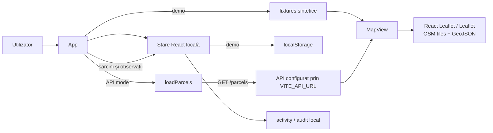

# Arhitectură bazată pe dovezi

Acest document descrie numai comportamentul verificabil în codul clientului web. Implementarea curentă concentrează orchestrarea, harta, conversia GeoJSON și starea locală în [`src/App.tsx`](../src/App.tsx); nu există module separate `src/map/ParcelMap.tsx`, `src/domain/geo.ts` sau `src/store.ts` în versiunea documentată.

## Flux la rulare

[`App`](../src/App.tsx) coordonează dashboard-ul, filtrele, selecția câmpului, tab-urile și acțiunile locale. `dataMode` alege între două surse:

- în modul `demo`, `readDemoWorkspace` citește cheia `farm-registry-demo-workspace-v1` din `localStorage` sau clonează [`demoWorkspace`](../src/fixtures.ts); modificările stării sunt apoi serializate în aceeași cheie;
- în modul `api`, TanStack Query apelează `loadParcels`, iar clientul din [`src/api.ts`](../src/api.ts) execută `GET /parcels` la baza definită prin `VITE_API_URL`. Configurația deployment-ului Render este documentată în [`README.md`](../README.md). Erorile și răspunsurile goale nu fac fallback la fixtures.

`MapView` compune `MapContainer`, `TileLayer` și `GeoJSON` din React Leaflet. URL-ul tile-urilor OpenStreetMap este configurat direct în componentă. `toFeatureCollection` transformă geometriile Polygon ale câmpurilor într-un `FeatureCollection`, iar `fieldToGeoJSON` pregătește exportul unui câmp.

## Limita scrierilor și a sincronizării

`createTask`, `completeTask`, `addObservation` și `reviewObservation` modifică exclusiv starea React și adaugă intrări prin `addAudit`. În modul demo, efectul de persistență copiază această stare în `localStorage`. În modul API, persistența în `localStorage` este dezactivată, deci schimbările rămân doar în memoria clientului pentru sesiunea curentă.

Clientul web nu apelează endpoint-uri backend de scriere pentru aceste acțiuni și nu implementează sincronizare între clienți. Funcțiile de citire pentru ferme, câmpuri, sarcini și observații există în `src/api.ts`, dar fluxul runtime al aplicației conectează numai `loadParcels` / `GET /parcels`.

## Limita datelor

[`src/fixtures.ts`](../src/fixtures.ts) definește ferme, câmpuri, sarcini, observații și activitate fictive, cu identificatori `SYN-*`. Geometriile și coordonatele sunt sintetice. Codul nu susține afirmații despre date GPS sau cadastrale reale, persoane reale, bază de date persistentă ori pregătire pentru producție.
